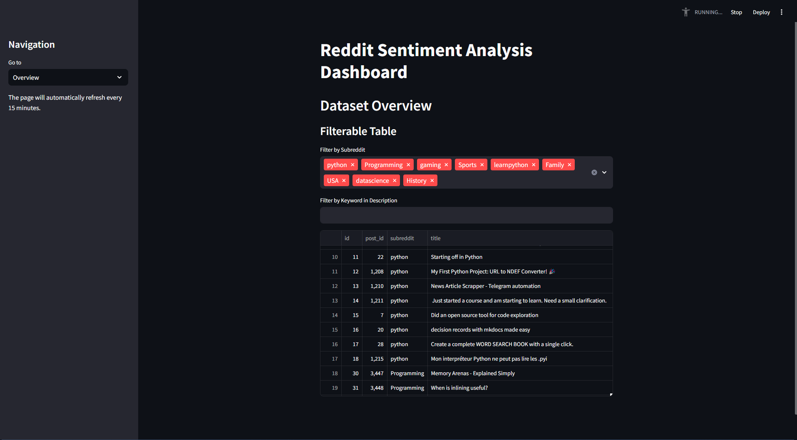
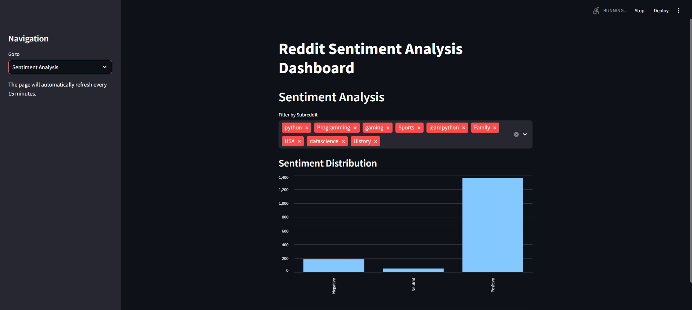
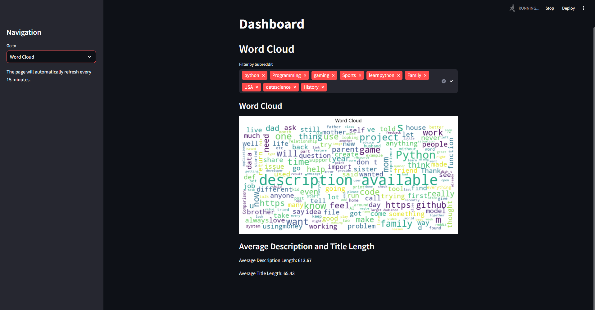
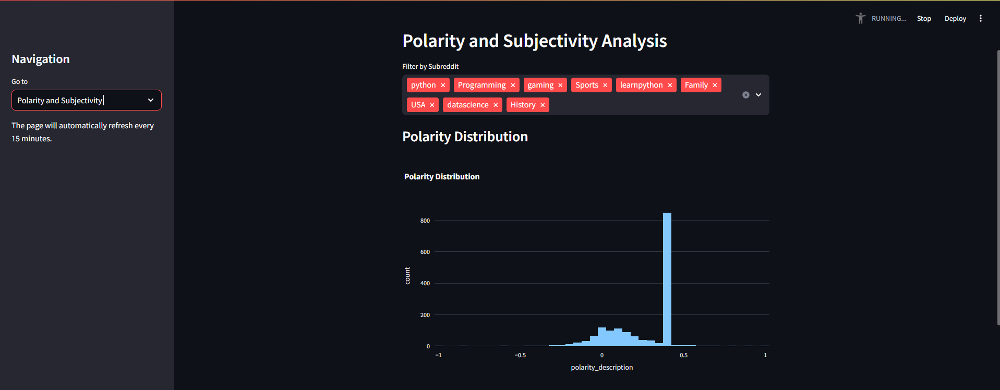
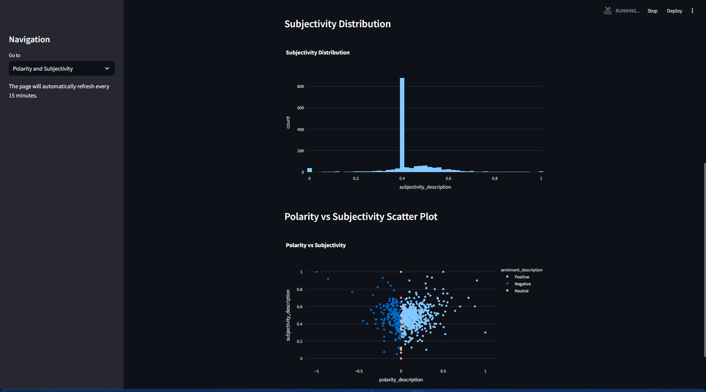

# Reddit Sentiment Analysis Dashboard

This project sets up a full pipeline to scrape Reddit posts, perform sentiment analysis, and visualize the results using a Streamlit dashboard. The application integrates with a PostgreSQL database to store and retrieve data.

---

## Project Structure

```plaintext
.
├── api.py                  # Fetches Reddit posts and stores them in the database
├── transform.py            # Performs sentiment analysis on stored Reddit posts
├── load.py                 # Visualizes data using Streamlit
├── requirements.txt        # Python dependencies
├── Dockerfile              # Dockerfile for containerizing the application
├── docker-compose.yml      # Docker Compose file to set up the app and PostgreSQL
```

---

## Components and Workflow

### 1. **api.py**
This script fetches data from Reddit using the PRAW (Python Reddit API Wrapper) library and inserts it into the `reddit_posts` table in PostgreSQL.

**Key Features:**
- Uses environment variables or default values for Reddit API credentials.
- Fetches posts from multiple subreddits (e.g., `python`, `gaming`, `USA`).
- Ensures no duplicate posts by enforcing a unique constraint on `subreddit` and `title` in the database.
- Schedules the fetch operation every 10 minutes.

**Commands:**
```python
python api.py
```

### 2. **transform.py**
This script fetches Reddit posts from the database, performs sentiment analysis on their titles and descriptions using the TextBlob library, and stores the results in the `reddit_sentiment_analysis` table.

**Key Features:**
- Recreates the `reddit_sentiment_analysis` table during each run.
- Calculates polarity and subjectivity scores for titles and descriptions.
- Inserts the analysis results into the database.
- Schedules the sentiment analysis task every 10 minutes.

**Commands:**
```python
python transform.py
```

### 3. **load.py**
This script creates an interactive dashboard using Streamlit to visualize the Reddit sentiment analysis data stored in the database.

**Key Features:**
- Displays:
  - Filterable table of data by subreddit and keywords.
  - Sentiment distribution charts.
  - Word clouds for post descriptions.
  - Polarity and subjectivity analysis.
- Automatically refreshes every 15 minutes.

**Commands:**
```bash
streamlit run load.py
```

### 4. **Dockerized Deployment**
The project is fully containerized using Docker and Docker Compose.

#### **Dockerfile**
- Creates a container image for the Python application.
- Installs all required dependencies and runs the Streamlit dashboard.

#### **docker-compose.yml**
- Defines services for:
  - `app`: Python application for fetching, transforming, and visualizing data.
  - `postgres`: PostgreSQL database to store Reddit data.

**Commands:**
```bash
# Build and run the containers
docker-compose up --build

# Stop the containers
docker-compose down
```

### 5. **PostgreSQL Database**
The application uses a PostgreSQL database with two tables:
- `reddit_posts`: Stores raw Reddit posts.
- `reddit_sentiment_analysis`: Stores sentiment analysis results.

---

## Environment Variables
You can configure the following environment variables in a `.env` file:

```plaintext
REDDIT_CLIENT_ID=1IZObZfK2ueN2QXd0ZQizA
REDDIT_CLIENT_SECRET=asNUjE3hQ2hiI-PSEwacmTd7esYciw
REDDIT_USER_AGENT=Shaheer
POSTGRES_DB=reddit_db
POSTGRES_USER=postgres
POSTGRES_PASSWORD=Mujhenahipata123.
POSTGRES_HOST=postgres
POSTGRES_PORT=5432
```

---

## Dependencies

All Python dependencies are listed in `requirements.txt` and are installed in the Docker container:

```plaintext
streamlit
pandas
psycopg2
textblob
plotly
matplotlib
wordcloud
schedule
praw
```

---

## Usage Instructions


4. **Stop the Containers**:
```bash
docker-compose down
```

---

## Orchestration
This project uses **orchestration** to automate the flow of tasks. The sequence includes:
1. Fetching Reddit posts using `api.py`.
2. Running sentiment analysis using `transform.py`.
3. Visualizing the results with Streamlit in `load.py`.
4. Docker Compose ensures all components (app and database) run cohesively in their respective containers, providing seamless integration.

---

## Troubleshooting

1. **Database Connection Issues:**
   - Ensure the PostgreSQL service is running and accessible.
   - Check credentials and environment variables.

2. **Missing Dependencies:**
   - Install missing dependencies using `pip install -r requirements.txt`.

3. **Port Conflicts:**
   - Ensure no other services are using port `8501` (Streamlit) or `5432` (PostgreSQL).

---

## App Screenshots

1. 

2. 

3. 

4. 

5. 


## Future Improvements

- Add more advanced sentiment analysis techniques (e.g., machine learning models).
- Introduce pagination for large datasets in the dashboard.
- Implement user authentication for the dashboard.
